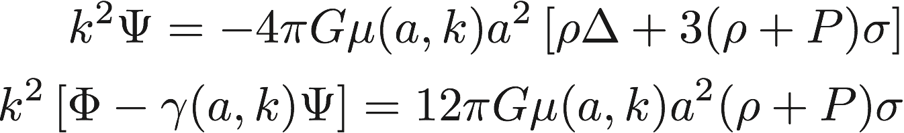
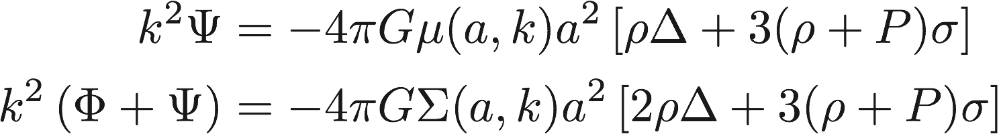
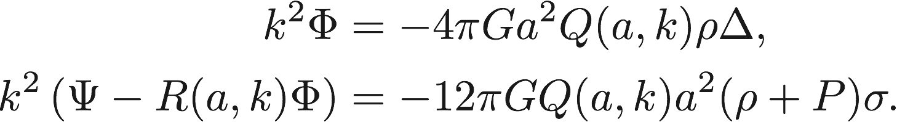
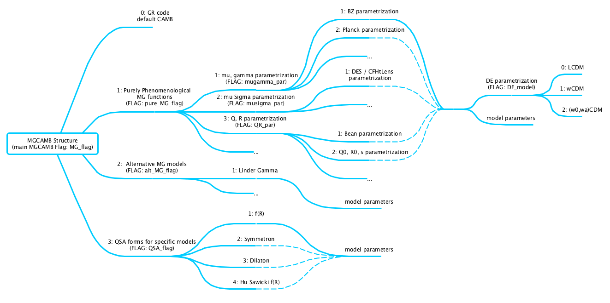
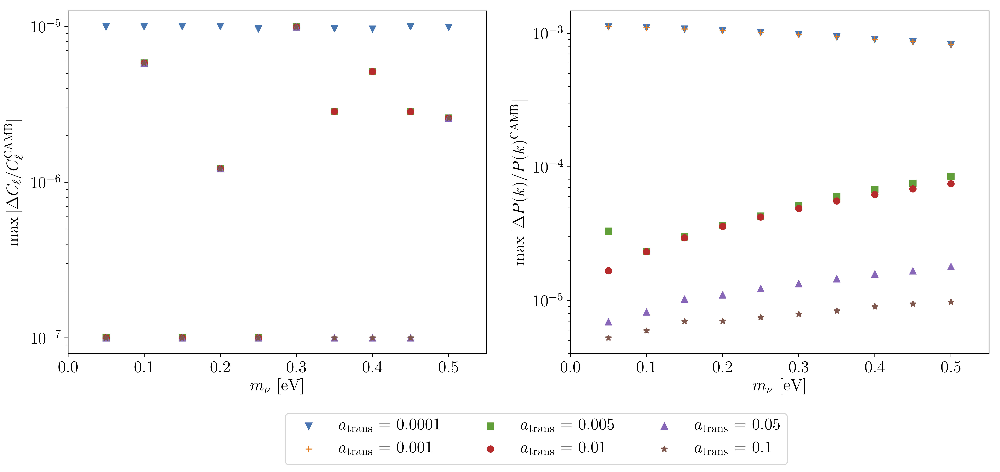

MGCAMB v3.0
===========
## Modified Growth with CAMB
This is the official repository for the MGCAMB v3.0 patch.  Below there are an introduction to the code and the instructions to install  and run the code. This new version of the code was introduced in the paper *MGCAMB with massive neutrinos and dynamical Dark Energy* (DE)


## Table of contents
* [1. Introduction](#1-introduction)
   * [Structure of the code](#structure-of-the-code)
   * [Consistency of the code](#consistency-of-the-code)
   * [Citing MGCAMB](#citing-mgcamb)
* [2. How to install](#2-how-to-install)
* [3. How to run](#3-how-to-run)
   * [Run the code](#run-the-code)
   * [Run the test suite](#run-the-test-suite)
* [4. What's new](#4-whats-new)
* [5. Examples](#5-examples)
* [6. Known Bugs](#6-known-bugs)
* [7. Authors List](#authors-list)

## 1. Introduction
Modified Growth with CAMB (MGCAMB) is a patch for the Einstein Boltzmann solver [CAMB](https://github.com/cmbant/CAMB) that intrdouces phenomenological Modifications of Growth (MG) along with dynamical Dark Energy (DE). It includes several phenomenological parametrizations. For instance:

- the mu, gamma parametrization, defined as
<p align="center">

</p>

- the mu, Sigma parametrization, defined as
<p align="center">

</p>

- the Q,R parametrization, defined as
<p align="center">

</p>

MGCAMB is implemented in the latest version of [CosmoMC](https://github.com/cmbant/CosmoMC). The MGCosmoMC code can be found on this [repository](https://github.com/sfu-cosmo/MGCosmoMC)

### Structure of the code
The new MGCAMB patch is structured as in the figure.

<p align="center">

</p>

The parameters in  [``` params_MG.ini ``` ](params_MG.ini) are used to run the code and follow the structure above. 
Please, note that dynamical DE is supported in the ``` pure_MG_models ```. 

### Consistency of the code
The General Relativity (GR) limit of the code has been tested. The results below show the maximum error obtained in the CMB TT spectrum and matter power spectrum when using the MG equations (in the GR limit) to evolve the system:

<p align="center">

</p>

For all  ``` GRtrans ``` times, the systematic maximum error is below 0.1%. This is achieved by delaying the time at which the Radiation Streaming Approximation (RSA) is switched on.  This slows down MGCAMB code with respect to the default CAMB code by a factor of two.


### Citing MGCAMB
If you use MGCAMB for your scientific work, please cite the following papers:

* *MGCAMB with massive neutrinos and dynamical dark energy*   
    Alex Zucca, Levon Pogosian, Alessandra Silvestri, and Gong-Bo Zhao  
    [arXiv:1901.05956 [astro-ph.CO]](https://arxiv.org/abs/1901.05956)
    
    
* *Testing Gravity with CAMB and CosmoMC*  
    Alireza Hojjati, Levon Pogosian, Gong-Bo Zhao,  
    [arXiv:1106.4543 [astro-ph.CO]](https://arxiv.org/abs/1106.4543), [JCAP 1108:005,2011](http://iopscience.iop.org/article/10.1088/1475-7516/2011/08/005)
    
    
* *Searching for modified growth patterns with tomographic surveys*  
    Gong-Bo Zhao, Levon Pogosian, Alessandra Silvestri, Joel Zylberberg,  
    [arXiv:0809.3791 [astro-ph]](http://arxiv.org/abs/0809.3791), [Phys. Rev. D 79, 083513](https://journals.aps.org/prd/abstract/10.1103/PhysRevD.79.083513)


as well as the original CAMB [paper](http://arxiv.org/abs/astro-ph/9911177). The file  [``` MGCAMB_references.bib```](mgcamb_notes/MGCAMB_references.bib) contains  all the references mentioned above.

## 2. How to install
To install MGCAMB in your machine simply run
```bash
git clone https://github.com/sfu-cosmo/MGCAMB.git
cd MGCAMB
make camb
```

## 3. How to run

### Run the code
To run MGCAMB, first modify the  [``` params_MG.ini ``` ](params_MG.ini) file according to which models you want to analyze. Then run

```bash
./camb params.ini
```


### Run the test suite
If you want to run the test suite to produce the consistency plots in our paper, then run

```bash
cd mgcamb_tests
make 
```


## 4. What's new
With these new version of the code we implemented consistently massive neutrinos, see accuracy plots above, and dynamical dark energy. 

Also, the code has been checked and restructured and updated to the CAMB 2018 version. 

The MG and DE parametrizations along with the computation of the quantities related to the perturbations are introduced in the file [``` mgcamb.f90 ```](mgcamb.f90).

## 5. Examples

## 6. Known Bugs
- **Fixed**. Bug in Hu-Sawicki f(R) gravity: ```MGCAMB_Mu``` and ```MGCAMB_Mudot``` functions had a wrong ```t1``` term.  Thanks to Ziad Sakr.

## 7. Authors List
Main Developer:
- [Alex Zucca](https://www.sfu.ca/physics/people/profiles/azucca.html) Email: azucca@sfu.ca

Original Code Developers:
* [Gong-Bo Zhao](http://icosmology.info)
* [Alireza Hojjati](http://www.phas.ubc.ca/%7Eahojjati/index.html)
* [Levon Pogosian](http://www.sfu.ca/%7Elevon/)
* [Alessandra Silvestri](http://wwwhome.lorentz.leidenuniv.nl/%7Esilvestri/Home.html)


Repo created and maintained by [Alex Zucca](https://github.com/alexzucca90). If you find any bugs in the code, please contact Alex Zucca at azucca@sfu.ca .

<p align="center">
    <a href="http://www.sfu.ca/physics.html"></a>
    <a href="http://www.sfu.ca/physics/cosmology/"></a>
</p>
